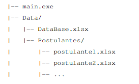

 # Duplicidad de RRHH

**Solución para identificar los Recursos Humanos que incumplen el límite de 168 horas mensuales financiadas por CORFO.**  


## Contenido

- [Inputs y Estructura Esperada](#inputs-y-estructura-esperada)
- [Supuestos Obligatorios](#supuestos-obligatorios)
- [Uso de la Aplicación](#uso-de-la-aplicación)
- [Output](#output)
- [Crear un Entorno Virtual (.venv) y Instalar Dependencias](#crear-un-entorno-virtual-venv-y-instalar-dependencias)
- [Crear un Entorno Conda e Instalar Dependencias](#crear-un-entorno-conda-e-instalar-dependencias)

## Inputs y Estructura Esperada

El ejecutable principal, `main.exe`, encargado de realizar todo el proceso, debe encontrarse en un directorio con la siguiente estructura:



### Descripción de los archivos:

- **`Database.xlsx`:**  
  Contiene los Recursos Humanos que están o estarán en proyectos vigentes financiados por CORFO.
  
- **`Postulantes/`:**  
  Contiene los archivos Excel con los postulantes de una convocatoria. Cada archivo Excel representa un postulante diferente.

**Nota:**  
Los nombres de las carpetas y el archivo `Database.xlsx` son obligatorios y deben respetarse.

Durante la ejecución de la solución, se pedirá como input la **fecha de inicio**, que corresponde a la fecha en la que inician los proyectos postulados en caso de ser aceptados.

## Supuestos Obligatorios

Es **OBLIGATORIO** cumplir con los siguientes supuestos. En caso de no cumplirse alguno, la solución podría arrojar errores o resultados inesperados.

### Supuestos:

1. **Estructura del archivo `Database.xlsx`:**
   - El archivo `Database.xlsx` debe tener una página llamada **"Prespuestos"**, correspondiente a los Recursos Humanos presupuestados.
   - Alternativamente, el archivo puede tener una sola página sin nombre.
   
2. **Columnas mínimas en `Database.xlsx`:**
   - Se asume que el archivo `Database.xlsx` contiene al menos las siguientes columnas:
     - `codigo_de_proyecto`
     - `rut_recurso_presupuesto`
     - `periodo_presupuesto`
     - `horas`
     - `nombre_fuente_de_financiamiento`
   - **Nota:** Las columnas pueden no estar normalizadas. La solución se encarga de normalizarlas automáticamente.

3. **Versiones de las librerías:**
   - Las versiones de las librerías utilizadas deben ser las mismas que las del archivo `.venv`. Es importante tener en cuenta que, en el futuro, las funciones de estas librerías podrían cambiar ligeramente, lo que podría requerir una actualización del código base.

4. **Estructura de las postulaciones:**
   - Cada postulación debe tener, como mínimo, las siguientes páginas en su archivo Excel:
     - **"RRHH"**
     - **"PLAN DE TRABAJO"** (solo si la postulación es de tipo **Crea-Valida**)
   
   **Columnas en la página "RRHH":**
   - La página "RRHH" debe contener las siguientes columnas:
     - `Nombre y Apellido`
     - `Rut`
     - `Dedicación proyecto:\nhoras al mes [A](*)`
     - `N° Meses [B]`
     - `Costo unitario ($)/HH`
     - `Aporte Innova Chile\n(Subsidio) ($)`
   - En caso de que la postulación sea de tipo **Crea-Valida**, la página "RRHH" tendrá estas mismas columnas, pero duplicadas: una para la etapa **Crea** y otra para la etapa **Valida**.

   **Columnas en la página "PLAN DE TRABAJO":**
   - La página "PLAN DE TRABAJO" debe contener las siguientes columnas:
     - `Mes de Inicio`
     - `Mes de Término`

---

### Notas adicionales:

- Asegúrate de que los nombres de las hojas y las columnas sean exactamente los indicados, ya que cualquier diferencia podría causar que la solución no funcione correctamente.

## Uso de la Aplicación

El repositorio contiene el ejecutable `main.exe`, que ejecuta la solución sobre la **Database.xlsx** y los **Postulantes**, siempre y cuando se cumpla con la "Estructura Esperada".

La solución es automática, pero se recibirá un input: **`fecha_de_inicio`**, que corresponde a la fecha en la que los proyectos postulados inician en caso de ser aceptados.

### Cálculo de la duración de la etapa Crea

Es importante mencionar que la duración de la etapa **Crea** de un proyecto es calculada utilizando la siguiente fórmula:

```python
if max_L == 0:
    return 0
elif max_L == min_K or max_L - min_K == 1:
    return 1
else:
    return max_L - min_K + 1
```

- max_L: El máximo mes de término del proyecto.
- min_K: El mínimo mes de inicio del proyecto.

Este cálculo determina el número de meses de duración de la etapa Crea.

---

## Output

La ejecución del programa generará una carpeta llamada **`Output`** que contendrá los siguientes archivos:

1. **`Postulantes_validos.csv`**:  
   Este archivo contiene los postulantes cuyo **RUT** es válido. Los datos estarán en formato CSV y permitirán filtrar los postulantes que cumplen con los requisitos de formato de RUT.

2. **`Postulantes_invalidos.csv`**:  
   Este archivo contiene los postulantes cuyo **RUT** es inválido. También estará en formato CSV y mostrará los postulantes con un RUT no válido según el formato estándar.

3. **`Topes_{FECHA_ACTUAL}.csv`**:  
   Este archivo contiene todos los Recursos Humanos (RRHH) que tienen un **tope de horas**. En este archivo se listan los RRHH que superan el límite de horas mensuales financiadas por CORFO, con los detalles de la fecha en que ocurrió y la distribución de proyectos asignada.

4. **`Topes_{FECHA_ACTUAL}.xlsx`**:  
   Este archivo está en formato Excel y contiene la misma información que el archivo CSV `Topes_{FECHA_ACTUAL}.csv`, pero con un formato más adecuado para trabajar con hojas de cálculo. También muestra todos los Recursos Humanos con topes, la fecha y la distribución de proyectos.

**Nota**:  
El valor `{FECHA_ACTUAL}` en los archivos CSV y Excel será reemplazado por la fecha en la que se ejecute el proceso (por ejemplo, `Topes_2024-12-16.csv`).

---

## Crear un Entorno Virtual (.venv) y Instalar Dependencias

Para trabajar con este proyecto en tu máquina local, es recomendable crear un entorno virtual donde puedas instalar todas las dependencias necesarias sin afectar a otros proyectos de Python. A continuación se indican los pasos para crear y activar el entorno virtual, y luego instalar las dependencias desde el archivo `requirements.txt`.

### Pasos:

1. **Crear el entorno virtual**  
   Primero, debes asegurarte de que tienes `python` y `pip` instalados. Para ello, puedes ejecutar los siguientes comandos en tu terminal:
   ```bash
   python --version
   pip --version
   ```

   Si tienes `python` y `pip` instalados correctamente, puedes proceder a crear el entorno virtual ejecutando el siguiente comando en el directorio raíz del proyecto:
   ```bash
   python -m venv .venv
   ```

2. **Activar el entorno virtual**  
   Después de crear el entorno virtual, debes activarlo. La manera de hacerlo depende de tu sistema operativo:

   - **En Windows:**
     ```bash
     .venv\Scripts\activate
     ```

   - **En macOS o Linux:**
     ```bash
     source .venv/bin/activate
     ```

   Verás que el nombre del entorno virtual (`.venv`) aparece al principio de la línea de comandos, lo que indica que el entorno está activado.

3. **Instalar las dependencias**  
   Con el entorno virtual activado, instala las dependencias del proyecto ejecutando el siguiente comando:
   ```bash
   pip install -r requirements.txt
   ```

   Este comando instalará todas las librerías listadas en el archivo `requirements.txt`.

4. **Desactivar el entorno virtual**  
   Cuando termines de trabajar, puedes desactivar el entorno virtual con el siguiente comando:
   ```bash
   deactivate
   ```

---

## Crear un Entorno Conda e Instalar Dependencias

Como alternativa al entorno virtual `.venv`, tambien puedes trabajar con un entorno Conda. El repositorio incluye el archivo `environment.yml`, que define el entorno `rrhh` y replica las dependencias necesarias para ejecutar el proyecto.

### Opcion 1: Crear el entorno desde `environment.yml`

1. **Abrir Anaconda Prompt o una terminal con Conda disponible**

   Verifica que Conda este instalado:
   ```bash
   conda --version
   ```

2. **Ubicarse en la carpeta raiz del proyecto**

   ```bash
   cd "C:\Users\esteban.berrios\OneDrive - corfo.cl\Documentos\PythonScripts\duplicidad-RRHH"
   ```

3. **Crear el entorno**

   ```bash
   conda env create -f environment.yml
   ```

4. **Activar el entorno**

   ```bash
   conda activate rrhh
   ```

5. **Verificar la instalacion**

   ```bash
   python --version
   python -c "import pandas, openpyxl; print('Entorno OK')"
   ```

6. **Ejecutar la aplicacion**

   ```bash
   python main.py
   ```

### Opcion 2: Crear el entorno manualmente e instalar `requirements.txt`

Si prefieres crear el entorno manualmente, puedes ejecutar:

```bash
conda create -n rrhh python=3.12 pip
conda activate rrhh
pip install -r requirements.txt
```

### Actualizar el entorno Conda

Si el entorno `rrhh` ya existe y se modifica `environment.yml`, puedes actualizarlo con:

```bash
conda env update -f environment.yml --prune
```

### Desactivar el entorno Conda

Cuando termines de trabajar, puedes desactivar el entorno con:

```bash
conda deactivate
```
